# [📈 Live Status](https://status.digreg.dev): <!--live status--> **🟧 Partial outage**

This repository contains the open-source uptime monitor and status page for [Daniele Di Gregorio](https://www.danieledigregorio.it/), powered by [Upptime](https://github.com/upptime/upptime).

With [Upptime](https://upptime.js.org), you can get your own unlimited and free uptime monitor and status page, powered entirely by a GitHub repository. We use [Issues](https://github.com/danieledigregorio/status/issues) as incident reports, [Actions](https://github.com/danieledigregorio/status/actions) as uptime monitors, and [Pages](https://status.digreg.dev) for the status page.

<!--start: status pages-->
<!-- This summary is generated by Upptime (https://github.com/upptime/upptime) -->
<!-- Do not edit this manually, your changes will be overwritten -->
<!-- prettier-ignore -->
| URL | Status | History | Response Time | Uptime |
| --- | ------ | ------- | ------------- | ------ |
|  [Daniele Di Gregorio](https://danieledigregorio.it) | 🟩 Up | [daniele-di-gregorio.yml](https://github.com/danieledigregorio/status/commits/HEAD/history/daniele-di-gregorio.yml) | 

 1418ms
     
 | 

<a href="https://status.digreg.dev/history/daniele-di-gregorio">100.00%</a>
    

|  [digreg.dev](https://digreg.dev) | 🟩 Up | [digreg-dev.yml](https://github.com/danieledigregorio/status/commits/HEAD/history/digreg-dev.yml) | 

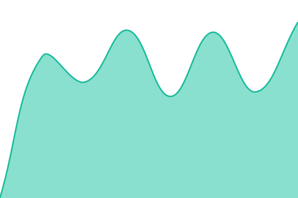 541ms
     
 | 

<a href="https://status.digreg.dev/history/digreg-dev">100.00%</a>
    

|  [digreg.dev API](https://api.digreg.dev) | 🟩 Up | [digreg-dev-api.yml](https://github.com/danieledigregorio/status/commits/HEAD/history/digreg-dev-api.yml) | 

 509ms
     
 | 

<a href="https://status.digreg.dev/history/digreg-dev-api">100.00%</a>
    

|  [digreg.dev MAIL](https://mail.digreg.dev) | 🟩 Up | [digreg-dev-mail.yml](https://github.com/danieledigregorio/status/commits/HEAD/history/digreg-dev-mail.yml) | 

 736ms
     
 | 

<a href="https://status.digreg.dev/history/digreg-dev-mail">100.00%</a>
    

|  [CineFX](https://cinefx.danieledigregorio.it) | 🟩 Up | [cine-fx.yml](https://github.com/danieledigregorio/status/commits/HEAD/history/cine-fx.yml) | 

 764ms
     
 | 

<a href="https://status.digreg.dev/history/cine-fx">100.00%</a>
    

|  [CineFX Account](https://account.cinefx.danieledigregorio.it) | 🟩 Up | [cine-fx-account.yml](https://github.com/danieledigregorio/status/commits/HEAD/history/cine-fx-account.yml) | 

 549ms
     
 | 

<a href="https://status.digreg.dev/history/cine-fx-account">100.00%</a>
    

|  [CineFX API](https://api-cinefx.danieledigregorio.it) | 🟩 Up | [cine-fx-api.yml](https://github.com/danieledigregorio/status/commits/HEAD/history/cine-fx-api.yml) | 

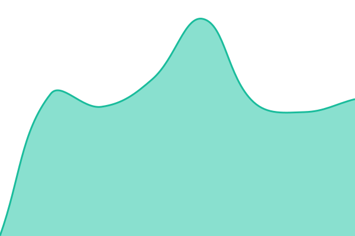 611ms
     
 | 

<a href="https://status.digreg.dev/history/cine-fx-api">100.00%</a>
    

|  [GoCicero](https://gocicero.it) | 🟩 Up | [go-cicero.yml](https://github.com/danieledigregorio/status/commits/HEAD/history/go-cicero.yml) | 

 1276ms
     
 | 

<a href="https://status.digreg.dev/history/go-cicero">100.00%</a>
    

|  [GoCicero Admin](https://admin.gocicero.it) | 🟩 Up | [go-cicero-admin.yml](https://github.com/danieledigregorio/status/commits/HEAD/history/go-cicero-admin.yml) | 

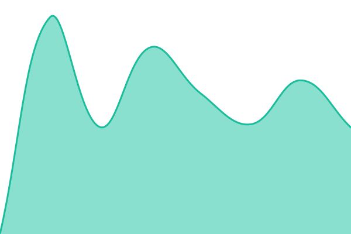 633ms
     
 | 

<a href="https://status.digreg.dev/history/go-cicero-admin">100.00%</a>
    

|  [GoCicero Utils](https://utils.gocicero.it) | 🟥 Down | [go-cicero-utils.yml](https://github.com/danieledigregorio/status/commits/HEAD/history/go-cicero-utils.yml) | 

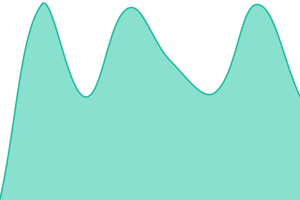 316ms
     
 | 

<a href="https://status.digreg.dev/history/go-cicero-utils">0.00%</a>
    

|  [GoCicero API](https://api.gocicero.it) | 🟩 Up | [go-cicero-api.yml](https://github.com/danieledigregorio/status/commits/HEAD/history/go-cicero-api.yml) | 

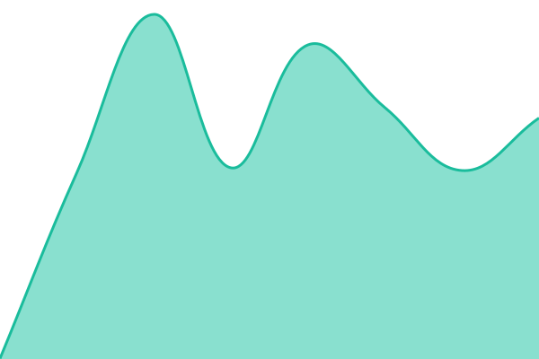 577ms
     
 | 

<a href="https://status.digreg.dev/history/go-cicero-api">100.00%</a>
    

|  [GoCicero MAIL](https://mail.gocicero.it) | 🟩 Up | [go-cicero-mail.yml](https://github.com/danieledigregorio/status/commits/HEAD/history/go-cicero-mail.yml) | 

 742ms
     
 | 

<a href="https://status.digreg.dev/history/go-cicero-mail">100.00%</a>
    

|  [OASI on the Street Admin](https://admin.mosaicorefugees.org) | 🟩 Up | [oasi-on-the-street-admin.yml](https://github.com/danieledigregorio/status/commits/HEAD/history/oasi-on-the-street-admin.yml) | 

 676ms
     
 | 

<a href="https://status.digreg.dev/history/oasi-on-the-street-admin">100.00%</a>
    

|  [OASI on the Street API](https://api.mosaicorefugees.org) | 🟩 Up | [oasi-on-the-street-api.yml](https://github.com/danieledigregorio/status/commits/HEAD/history/oasi-on-the-street-api.yml) | 

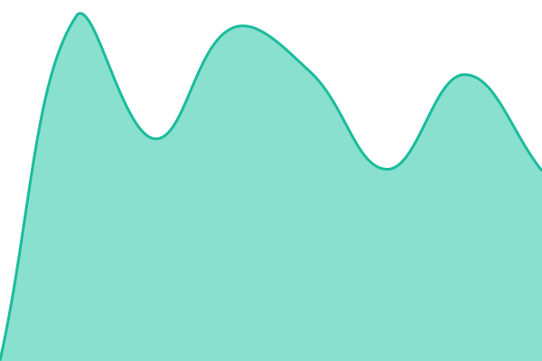 668ms
     
 | 

<a href="https://status.digreg.dev/history/oasi-on-the-street-api">100.00%</a>
    

|  [SARANNOPURECAZZIMIEI](https://sarannopurecazzimiei.it) | 🟥 Down | [sarannopurecazzimiei.yml](https://github.com/danieledigregorio/status/commits/HEAD/history/sarannopurecazzimiei.yml) | 

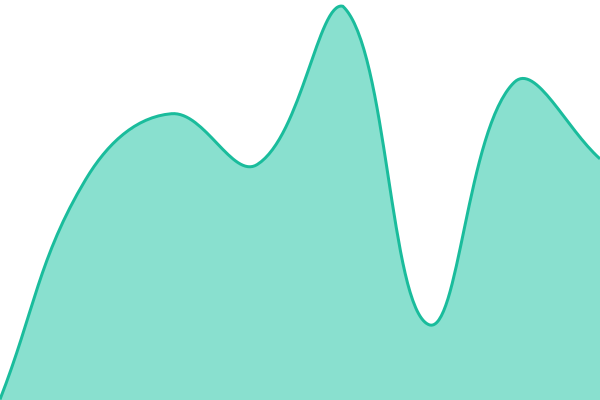 440ms
     
 | 

<a href="https://status.digreg.dev/history/sarannopurecazzimiei">0.00%</a>
    

|  [SARANNOPURECAZZIMIEI API](https://api.sarannopurecazzimiei.it) | 🟩 Up | [sarannopurecazzimiei-api.yml](https://github.com/danieledigregorio/status/commits/HEAD/history/sarannopurecazzimiei-api.yml) | 

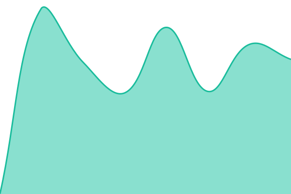 637ms
     
 | 

<a href="https://status.digreg.dev/history/sarannopurecazzimiei-api">100.00%</a>
    

|  [EmeraldMonde](https://emeraldmonde.com) | 🟩 Up | [emerald-monde.yml](https://github.com/danieledigregorio/status/commits/HEAD/history/emerald-monde.yml) | 

 1431ms
     
 | 

<a href="https://status.digreg.dev/history/emerald-monde">96.84%</a>
    

|  [EmeraldMonde MAIL](https://mail.emeraldmonde.com) | 🟩 Up | [emerald-monde-mail.yml](https://github.com/danieledigregorio/status/commits/HEAD/history/emerald-monde-mail.yml) | 

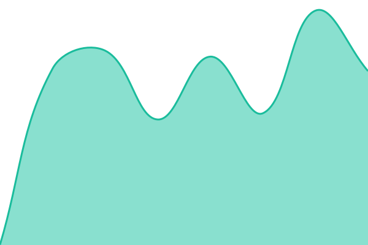 787ms
     
 | 

<a href="https://status.digreg.dev/history/emerald-monde-mail">100.00%</a>
    

|  [Golden Basin](https://goldenbasin.it) | 🟩 Up | [golden-basin.yml](https://github.com/danieledigregorio/status/commits/HEAD/history/golden-basin.yml) | 

 1929ms
     
 | 

<a href="https://status.digreg.dev/history/golden-basin">100.00%</a>
    

|  [Golden Basin MAIL](https://mail.goldenbasin.it) | 🟩 Up | [golden-basin-mail.yml](https://github.com/danieledigregorio/status/commits/HEAD/history/golden-basin-mail.yml) | 

 805ms
     
 | 

<a href="https://status.digreg.dev/history/golden-basin-mail">100.00%</a>
    

|  [Prime Shop](https://primeshop.pro) | 🟩 Up | [prime-shop.yml](https://github.com/danieledigregorio/status/commits/HEAD/history/prime-shop.yml) | 

 1914ms
     
 | 

<a href="https://status.digreg.dev/history/prime-shop">97.31%</a>
    

|  [Prime Shop MAIL](https://mail.primeshop.pro) | 🟩 Up | [prime-shop-mail.yml](https://github.com/danieledigregorio/status/commits/HEAD/history/prime-shop-mail.yml) | 

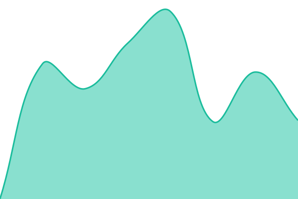 713ms
     
 | 

<a href="https://status.digreg.dev/history/prime-shop-mail">100.00%</a>
    

|  [Scalp Squad Barberia](https://scalpsquadbarberia.it) | 🟩 Up | [scalp-squad-barberia.yml](https://github.com/danieledigregorio/status/commits/HEAD/history/scalp-squad-barberia.yml) | 

 1431ms
     
 | 

<a href="https://status.digreg.dev/history/scalp-squad-barberia">100.00%</a>
    

|  [Scalp Squad Barberia Booking](https://booking.scalpsquadbarberia.it) | 🟩 Up | [scalp-squad-barberia-booking.yml](https://github.com/danieledigregorio/status/commits/HEAD/history/scalp-squad-barberia-booking.yml) | 

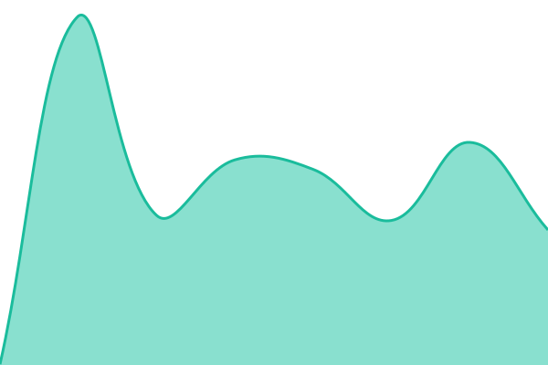 246ms
     
 | 

<a href="https://status.digreg.dev/history/scalp-squad-barberia-booking">100.00%</a>
    

|  [Scalp Squad Barberia Admin](https://admin.scalpsquadbarberia.it) | 🟩 Up | [scalp-squad-barberia-admin.yml](https://github.com/danieledigregorio/status/commits/HEAD/history/scalp-squad-barberia-admin.yml) | 

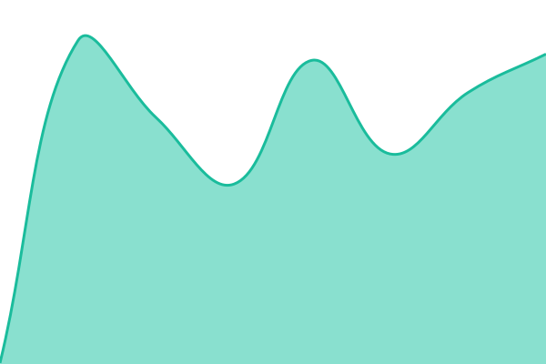 255ms
     
 | 

<a href="https://status.digreg.dev/history/scalp-squad-barberia-admin">100.00%</a>
    

|  [Scalp Squad Barberia MAIL](https://mail.scalpsquadbarberia.it) | 🟩 Up | [scalp-squad-barberia-mail.yml](https://github.com/danieledigregorio/status/commits/HEAD/history/scalp-squad-barberia-mail.yml) | 

 829ms
     
 | 

<a href="https://status.digreg.dev/history/scalp-squad-barberia-mail">100.00%</a>
    

|  [Scalp Squad Barberia Whatsapp Service](https://whatsapp.danieledigregorio.it) | 🟩 Up | [scalp-squad-barberia-whatsapp-service.yml](https://github.com/danieledigregorio/status/commits/HEAD/history/scalp-squad-barberia-whatsapp-service.yml) | 

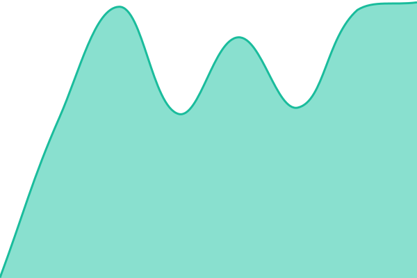 586ms
     
 | 

<a href="https://status.digreg.dev/history/scalp-squad-barberia-whatsapp-service">100.00%</a>
    

|  [DieciDiciotto](https://diecidiciotto.com) | 🟩 Up | [dieci-diciotto.yml](https://github.com/danieledigregorio/status/commits/HEAD/history/dieci-diciotto.yml) | 

 1071ms
     
 | 

<a href="https://status.digreg.dev/history/dieci-diciotto">100.00%</a>
    

|  [Laugh Tales](https://laughtales.it) | 🟩 Up | [laugh-tales.yml](https://github.com/danieledigregorio/status/commits/HEAD/history/laugh-tales.yml) | 

 1435ms
     
 | 

<a href="https://status.digreg.dev/history/laugh-tales">100.00%</a>
    

|  [MGM Solar MEDIA](https://media.mgmsolar.it) | 🟥 Down | [mgm-solar-media.yml](https://github.com/danieledigregorio/status/commits/HEAD/history/mgm-solar-media.yml) | 

 0ms
     
 | 

<a href="https://status.digreg.dev/history/mgm-solar-media">0.00%</a>
    

|  [New Ander 1962](https://newander1962.com) | 🟩 Up | [new-ander-1962.yml](https://github.com/danieledigregorio/status/commits/HEAD/history/new-ander-1962.yml) | 

 1211ms
     
 | 

<a href="https://status.digreg.dev/history/new-ander-1962">100.00%</a>
    

|  [Pets App](https://pets-app.it) | 🟩 Up | [pets-app.yml](https://github.com/danieledigregorio/status/commits/HEAD/history/pets-app.yml) | 

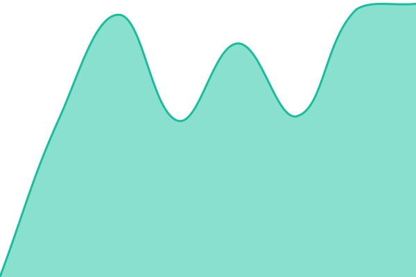 1428ms
     
 | 

<a href="https://status.digreg.dev/history/pets-app">100.00%</a>
    

|  [Pets App MAIL](https://mail.pets-app.it) | 🟩 Up | [pets-app-mail.yml](https://github.com/danieledigregorio/status/commits/HEAD/history/pets-app-mail.yml) | 

 838ms
     
 | 

<a href="https://status.digreg.dev/history/pets-app-mail">100.00%</a>
    

|  [PiGreco Advisor](https://pigrecoadvisor.com) | 🟩 Up | [pi-greco-advisor.yml](https://github.com/danieledigregorio/status/commits/HEAD/history/pi-greco-advisor.yml) | 

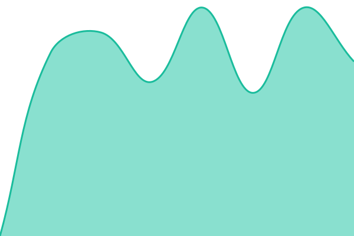 2347ms
     
 | 

<a href="https://status.digreg.dev/history/pi-greco-advisor">95.05%</a>
    

|  [Daniele Di Gregorio MAIL](https://mail.danieledigregorio.it) | 🟩 Up | [daniele-di-gregorio-mail.yml](https://github.com/danieledigregorio/status/commits/HEAD/history/daniele-di-gregorio-mail.yml) | 

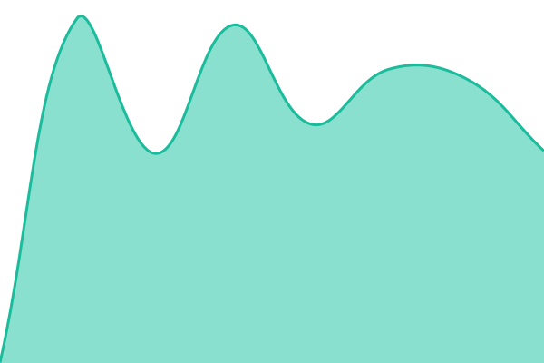 841ms
     
 | 

<a href="https://status.digreg.dev/history/daniele-di-gregorio-mail">100.00%</a>
    

|  [Luigi Mennella MAIL](https://mail2.luigimennella.com) | 🟩 Up | [luigi-mennella-mail.yml](https://github.com/danieledigregorio/status/commits/HEAD/history/luigi-mennella-mail.yml) | 

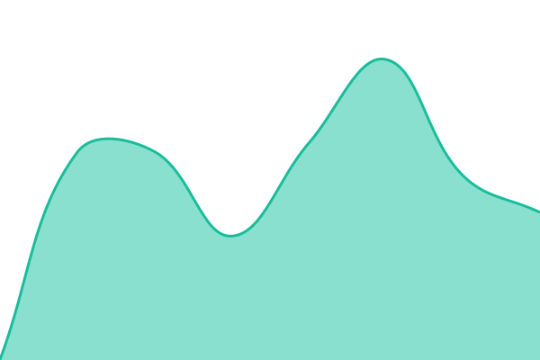 715ms
     
 | 

<a href="https://status.digreg.dev/history/luigi-mennella-mail">100.00%</a>
    

<!--end: status pages-->

[**Visit our status website →**](https://status.digreg.dev)

## 📄 License

- Powered by: [Upptime](https://github.com/upptime/upptime)
- Code: [MIT](./LICENSE) © [Anand Chowdhary](https://anandchowdhary.com), supported by [Pabio](https://pabio.com)
- Data in the `./history` directory: [Open Database License](https://opendatacommons.org/licenses/odbl/1-0/)
